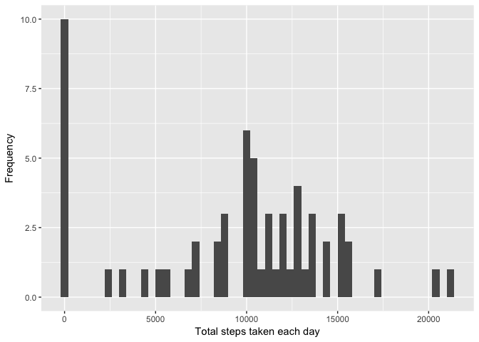
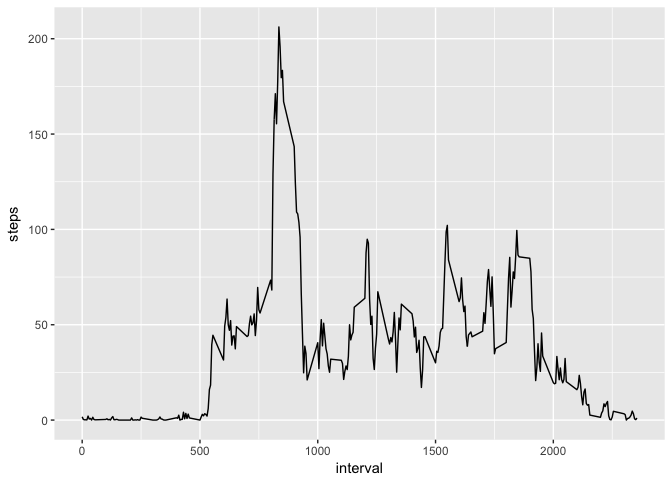
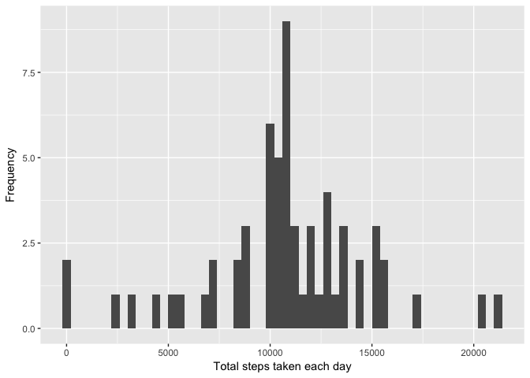
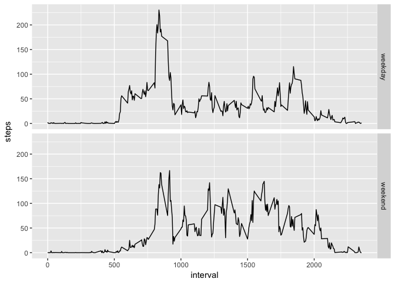

# Reproducible Research: Peer Assessment 1


## Loading and preprocessing the data

1. Load the data

```r
setwd("~/Documents")
data <- read.csv("activity.csv", header=TRUE)
```


## What is mean total number of steps taken per day?

1. Calculate the total number of steps taken per day

```r
total_steps <- tapply(data$steps, data$date, FUN=sum, na.rm=TRUE)
```

2. Make a histogram of the total number of steps taken each day

```r
qplot(total_steps, geom="histogram", xlab="Total steps taken each day", ylab='Frequency', binwidth=400)
```

<!-- -->

3. Calculate and report the mean and median of the total number of steps taken per day

```r
mean_total_steps <- mean(total_steps)
median_total_steps <- median(total_steps)
```
Mean: 9354 steps.  
Median: 10395 steps.

## What is the average daily activity pattern?

1. Make a time series plot of the 5-minute interval (x-axis) and the average number of steps taken, averaged across all days (y-axis)

```r
avg_steps <- aggregate(steps~interval, data=data, mean)
# plot(avg_steps$interval, avg_steps$steps, type = "l", xlab = "5-minute intervals", ylab = "Average steps per interval")
qplot(interval, steps, data=avg_steps, geom = "line")
```

<!-- -->

2. Which 5-minute interval, on average across all the days in the dataset, contains the maximum number of steps?

```r
max_interval <- avg_steps[which.max(avg_steps$steps), 1]
```
Interval: 835

## Imputing missing values

1. Calculate and report the total number of missing values in the dataset

```r
na_intervals <- is.na(data$steps)
total_na <- sum(na_intervals)
```
Total number of missing values: 2304  

2. Devise a strategy for filling in all of the missing values in the dataset: we replace all NAs with the mean for that 5-minute interval.

```r
new_data <- data
bad <- is.na(new_data$steps)
avg_intervalsteps <- tapply(new_data$steps, new_data$interval, mean, na.rm=TRUE)
new_data$steps[bad] <- avg_intervalsteps[as.character(new_data$interval[bad])]
```

3. Create a new dataset that is equal to the original dataset but with the missing data filled in.


4. Make a histogram of the total number of steps taken each day and Calculate and report the mean and median total number of steps taken per day.

```r
new_total_steps <- tapply(new_data$steps, new_data$date, sum, na.rm=TRUE)
qplot(new_total_steps, geom="histogram", xlab="Total steps taken each day", ylab='Frequency', binwidth=400)
```

<!-- -->

```r
new_mean <- mean(new_total_steps)
new_median <- median(new_total_steps)
```
Mean: 10766 steps.  
Median: 10766 steps.


Do these values differ from the estimates from the first part of the assignment?  
In the first part, mean was 9354 steps and median was 10395 steps. Therefore, after imputing missing values, we get higher mean and median.


What is the impact of imputing missing data on the estimates of the total daily number of steps?  
Comparing the two histogram, we can see that the distribution becomes more symmetrical after imputing missing values - we have higher clusters in the middle and lower clusters on the tail sides.  

## Are there differences in activity patterns between weekdays and weekends?

1. Create a new factor variable in the dataset with two levels – “weekday” and “weekend” indicating whether a given date is a weekday or weekend day.

```r
new_data$date <- as.Date(as.character(new_data$date), "%Y-%m-%d")
new_data$sevenday <- weekdays(new_data$date)
weekend <- c("Saturday", "Sunday")
new_data$week <- ifelse(new_data$sevenday %in% weekend, "weekend","weekday")
```

2. Make a panel plot containing a time series plot of the 5-minute interval (x-axis) and the average number of steps taken, averaged across all weekday days or weekend days (y-axis).

```r
avg_week_steps <- aggregate(steps ~ interval + week, data=new_data, mean)
qplot(interval, steps, data=avg_week_steps, geom = "line", facets= week~.)
```

<!-- -->
